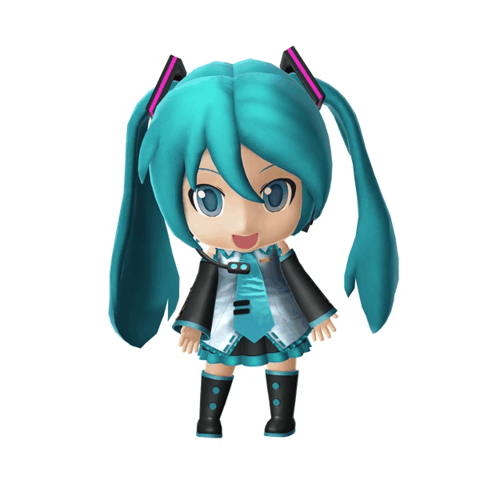

# image_deform_pde




this is a Python tool that lets you play around with images using physics-inspired effects.
This is a fun way to explore how simple PDEs affect image data. It’s great for learning or experimenting with visual effects inspired by math and physics.


## Usage

clone this repo and install the requirements:

```bash
git clone https://github.com/wowowo-wo/image_deform_pde
cd image_deform_pde
pip install -r requirements.txt
```

for a wave eq effect:

```bash
python3 -m cli wave --input1 image1.jpg --input2 image2.jpg --output wave_result.gif --num-iter 512 --skip-step 2 --weight 0.2 --noise-freq 3 --noise-strength 5.0
```

for a heat eq effect:

```bash
python3 -m cli heat --input image1.jpg --output heat_result.gif --num-iter 200 --skip-step 2 --weight 0.2 --noise-freq 3 --noise-strength 5.0
```

or you can run this tool with a GUI using Streamlit:

```bash
pip install streamlit
streamlit run gui.py
```

then, open the URL shown in your brouser.


You can tweak the parameters to control how the effect looks.


this repo includes some images for test, so you can jump right in and try things out without needing to find your own picture.

example(The above gif was generated using this command):

```bash
python3 -m cli wave --input1 imgs_for_test/loveless.jpg --input2 imgs_for_test/mikudayo.webp --output result.gif --num-iter 512 --skip-step 2 --weight 0.2 --noise-freq 3 --noise-strength 5.0
```

## Requirements

```bash
pip install -r requirements.txt
```
